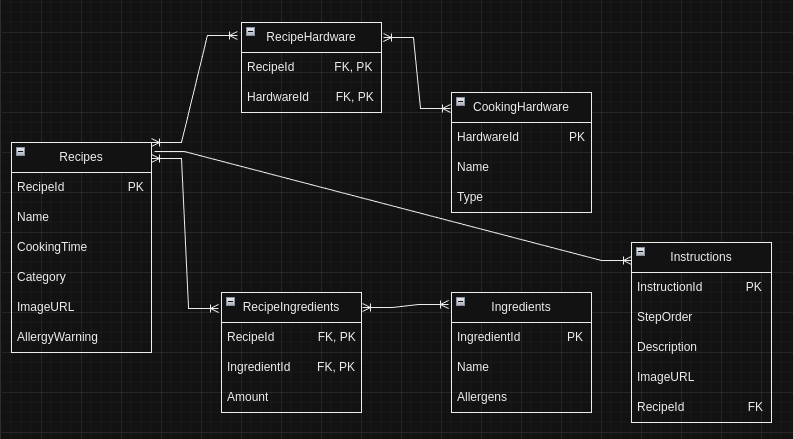

# DatabaseProject by Andrei Gulin

**Program of Study:** IT  
**Date:** 30 Mar. 2024

## Project Structure

The project is organized into specific directories to streamline development and deployment:

```
.
├── creation_scripts
│   ├── creation_database.sql       --creation of the database
│   ├── creation_scripts.sql        --creation of tables
│   └── README.md
├── insertion_scripts
│   ├── development_scripts.sql     --fetching, updating, deleting, finding data
│   ├── insertion_scripts.sql       --insertion sample data in the tables
│   └── README.md
├── README.md                       --main report
└── recipes_entity_table.png        --diagram of the database structure
```

Each directory contains SQL scripts and README files that detail the purposes and functionalities of the scripts within, ensuring clarity and ease of use.

## Overview

This project focuses on developing a relational database for a food recipe management application. It aims to catalog recipes, their ingredients, required cooking hardware, instructions, and categorize recipes for easy navigation and user interaction.

## Requirement Analysis

The application is built to facilitate the following core functionalities:

- **Recipe Management:** Empowering users to add, update, or delete recipes.
- **Detailed Recipe Information:** Providing exhaustive details for each recipe, including ingredients, cooking hardware, step-by-step instructions, total cooking time, and food allergy warnings.
- **Ingredient Flexibility:** Offering suggestions for optional or alternative ingredients to enhance recipe adaptability and accommodate diverse dietary needs.
- **Recipe Suggestions:** Enabling recipe searches based on available ingredients, with the system recommending recipes based on these inputs and suggesting similar or alternative recipes for exploration.

## Future Feature Considerations

To further enrich the user experience, the following features are under consideration:

- **User Profiles:** To enable personalized recipe recommendations, dietary tracking, and a repository for favorite recipes.
- **Social Integration:** Encouraging users to share recipes, rate them, and provide feedback, nurturing a vibrant culinary community.
- **Dietary Restrictions:** Including comprehensive dietary restriction information to refine recipe searches according to specific needs (e.g., vegan, gluten-free, nut-free).
- **Seasonal and Regional Cuisines:** Facilitating recipe discovery based on seasonal ingredient availability or regional culinary explorations.
- **Cooking Skill Levels:** Catering to a wide range of users, from beginners to experienced chefs, by classifying recipes according to difficulty or required skill level.

## Schema Design

The database schema is meticulously designed to efficiently manage the extensive data involved in recipe management, comprising the following components:

### Tables:

- **Recipes:** The core entity, detailing each recipe's name, cooking time, category, and other pertinent information.
- **Ingredients:** Cataloging ingredients used across recipes and their potential allergens.
- **Cooking Hardware:** Listing the tools required for preparing recipes.
- **Instructions:** Outlining step-by-step cooking procedures for each recipe.

### Relationships and Keys:

- **Many-to-Many Relationships:** Between Recipes and Ingredients, and Recipes and Cooking Hardware, managed through junction tables (`RecipeIngredients`, `RecipeHardware`) to handle the multifaceted nature of cooking processes.
- **One-to-Many Relationship:** From Recipes to Instructions, aligning with the sequential execution of cooking steps.

### Junction Tables:

- **RecipeIngredients:** Tracks ingredients for each recipe, including quantities.
- **RecipeHardware:** Associates recipes with their necessary cooking tools.

This foundational schema supports the application's immediate needs while allowing for future expansions.



---

## Overcoming Deletion Challenges with Cascading Deletes

During the development of the Recipe Management application, I encountered a significant challenge that put the data integrity to the test. Initially, when attempting to delete a recipe from the database, I faced the dreaded `ERROR 1451 (23000): Cannot delete or update a parent row: a foreign key constraint fails`. This error was a clear indication that the database's referential integrity constraints were preventing the deletion of a recipe due to existing references in other related tables.

### The Challenge

The core of the challenge lay in the interconnected nature of the designed database schema. The recipes, ingredients, cooking hardware, and instructions were all intricately linked through various relationships, making it impossible to delete a recipe without first manually removing all related entries from connected tables. This was not only cumbersome but prone to human error, risking the loss of data integrity and coherence in the application.

### The Solution

Determined to find a more efficient and reliable solution, I turned to the concept of **Cascading Deletes**. By implementing `ON DELETE CASCADE` on the foreign key constraints, I enabled the automatic deletion of related entries in connected tables whenever a parent row was deleted. This was a proper decision.

```markdown
ALTER TABLE Instructions
ADD CONSTRAINT fk_instructions_recipes
FOREIGN KEY (RecipeId) REFERENCES Recipes(RecipeId)
ON DELETE CASCADE;
```

This simple yet powerful alteration to the foreign key constraints ensured that deleting a recipe would automatically and safely remove all associated instructions, ingredients, and hardware requirements, maintaining the pristine integrity of the database.

### The Impact

Implementing cascading deletes not only solved the deletion challenge but also streamlined the database management process, making it more efficient and less error-prone. It reinforced the robustness of the application's data handling capabilities, allowing to focus on enhancing user features and functionalities rather than worrying about database integrity issues.

### In Retrospect

Looking back, the journey from facing a seemingly insurmountable challenge to finding a reliable solution was incredibly rewarding. It underscored the importance of a well-thought-out database schema and the power of SQL's cascading features in preserving data integrity and simplifying database operations.

---
